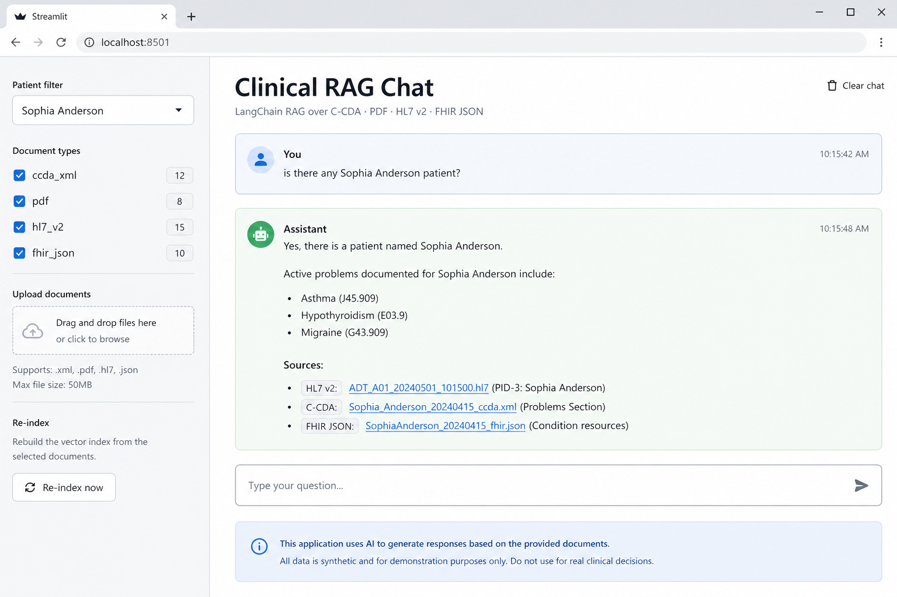
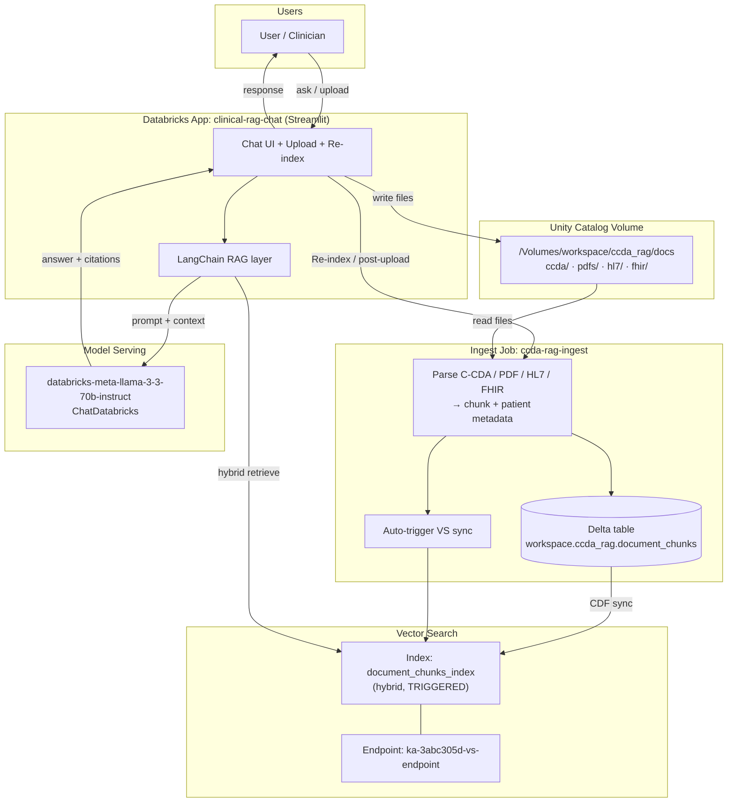

# Multi-format Clinical RAG (LangChain + Streamlit)

Databricks App that answers questions over **C-CDA**, **PDF**, **HL7 v2**, and **FHIR JSON** using LangChain + Vector Search.

## Example UI

Example question: *is there any Sophia Anderson patient?*



## Architecture of clinical-rag-chat



**Data flow**

1. Upload docs to `/Volumes/workspace/ccda_rag/docs` (`ccda/`, `pdfs/`, `hl7/`, `fhir/`)
2. Ingest job `ccda-rag-ingest` → `workspace.ccda_rag.document_chunks` (also auto-triggers Vector Search sync)
3. Vector Search index `workspace.ccda_rag.document_chunks_index` (hybrid, TRIGGERED)
4. Streamlit app retrieves with LangChain `DatabricksVectorSearch` and answers via `ChatDatabricks` (Llama)

## App

| Item | Value |
|------|--------|
| Name | `clinical-rag-chat` |
| Path | `app/clinical-rag-chat` |
| LLM | `databricks-meta-llama-3-3-70b-instruct` |
| VS endpoint | `ka-3abc305d-vs-endpoint` |
| Ingest job | `1026899989768735` |

## Deploy

```powershell
cd app\clinical-rag-chat
databricks apps deploy -t default --profile dbc-7c3eed4c --auto-approve
```

## Re-ingest after uploads

Upload via the app (UC Files API) or:

```powershell
# Prefer Files REST API so Spark/SQL can see the files
$token = (databricks auth token -p dbc-7c3eed4c -o json | ConvertFrom-Json).access_token
# PUT to https://<host>/api/2.0/fs/files/Volumes/workspace/ccda_rag/docs/<folder>/<file>?overwrite=true

databricks jobs run-now 1026899989768735 --profile dbc-7c3eed4c --no-wait
databricks vector-search-indexes sync-index workspace.ccda_rag.document_chunks_index --profile dbc-7c3eed4c
```

If sync is stuck (`pipeline ... CREATED`), stop the VS sync pipeline then re-sync:

```powershell
databricks pipelines stop bd6baf44-ea7a-4d58-89b2-06a974da54cd --profile dbc-7c3eed4c
databricks pipelines start-update bd6baf44-ea7a-4d58-89b2-06a974da54cd --profile dbc-7c3eed4c
```

## Local notes

Uses Databricks Apps service-principal auth (`WorkspaceClient()` / `Config()`). No tokens in source.
Synthetic demo data only — AI answers must be verified.
